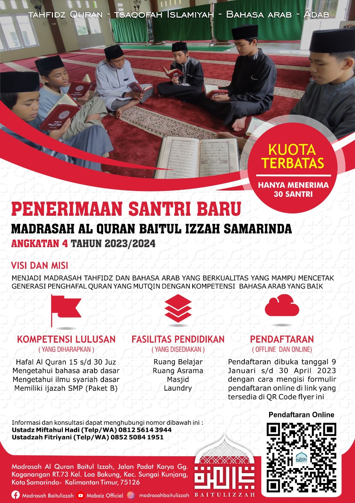

# Madrasah Baitul Izzah Samarinda

Madrasah Baitul Izzah adalah lembaga pendidikan khusus tahfidzul Quran (menghafal dan memahami Al-Quran) dan bahasa Arab (terutama bahasa Arab percakapan untuk sehari-hari) setingkat SMP.

Website ini akan berisi dengan berbagai informasi tentang Madrasah Baitul Izzah Samarinda.

Untuk ayah bunda yang ingin anaknya menjadi penghafal Quran, bisa mendaftar di Madrasah Baitul Izzah Samarinda karena penerimaan santri baru 2023/2024 sudah dibuka:

[KLIK UNTUK MENDAFTAR](./penerimaan-santri-baru/tahun-2023.md)

## Kegiatan Madrasah Baitul Izzah Samarinda

[Tafakur Alam di Air Terjun Perjiwa](./kegiatan/tafakur-alam.md)
